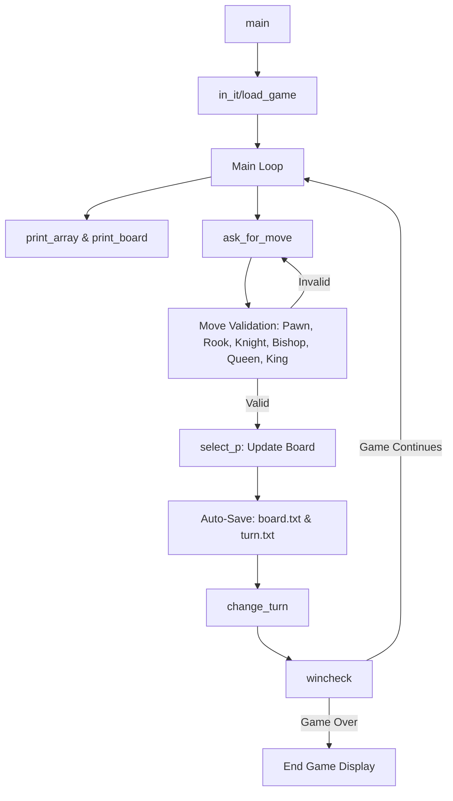

# Chess Game Architecture

## 1. System Design
The project is built as a console application in C++ designed for standard Windows Command Prompt/terminal windows. It operates using a single main loop with procedural logic and 1D-array representations of the game state.

---

## 2. Component Breakdown

- **Data Model (Board State)**:
  - Represented as a flat `char B[64]` array.
  - Uppercase letters (`P`, `R`, `N`, `B`, `Q`, `K`) represent Player 1 pieces.
  - Lowercase letters (`p`, `r`, `n`, `b`, `q`, `k`) represent Player 2 pieces.
  - Empty space is represented by character `' '` (internally saved as `_` in `board.txt` for readability/saving).

- **Board Translation Layer**:
  - `two_oned(int r, int c, int ri, int ci, int dim, int &score, int &scorei)`: Converts user 2D grid coordinates (1-based index) to 1D index markers.
  - Calculations: `score = (r - 1) * dim + (c - 1)` for source and target positions.

- **Rendering Layer**:
  - Uses Windows SDK Console API (`COORD`, `GetStdHandle`, `SetConsoleCursorPosition`) to control output cursor placement.
  - Modifies specific zones on the terminal screen directly using `gotoRowCol` to eliminate full-screen redrawing and cursor flickering.

- **Persistence Layer**:
  - File I/O (`ifstream` / `ofstream`) is integrated directly into the game loop.
  - Automatically serializes `B` to `board.txt` and `turn` status to `turn.txt` after every valid move.

---

## 3. Move Validation Logic

Validation relies on checks against grid differentials:
- **Vertical/Horizontal Checks**: Compares column quotient (`score % dim`) and row quotient (`score / dim`). If one difference is zero, movement is purely along one axis. Used in `rook` and `queen` checks.
- **Diagonal Checks**: Checks if the absolute difference in rows equals the absolute difference in columns: `abs(rowDiff) == abs(colDiff)`. Used in `bishop` and `queen` checks.
- **Intervening Piece Scans**: Loop-scans all index cells between the `small` index and `large` index to ensure no other pieces block the path (for Rook, Bishop, Queen).
- **Index Shifts**: The knight evaluates legal moves by examining index offsets (`+6`, `+10`, `+15`, `+17`, `-6`, `-10`, `-15`, `-17`).
